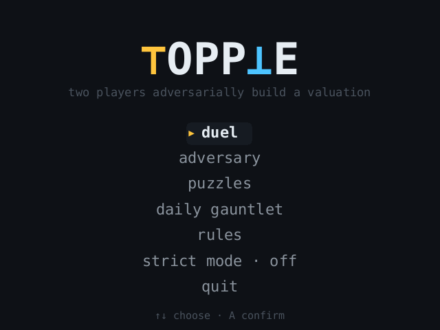
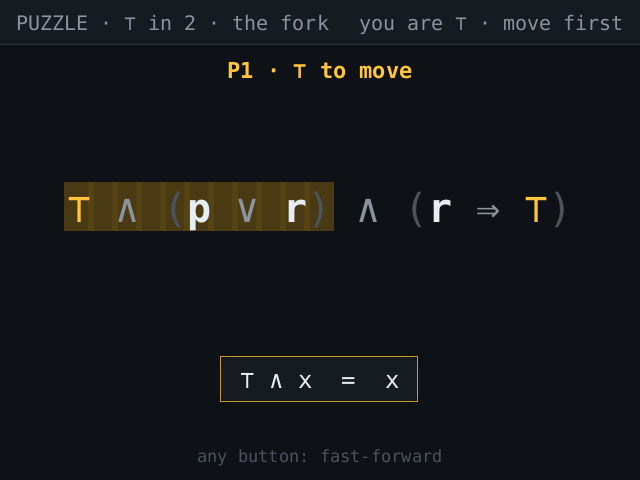
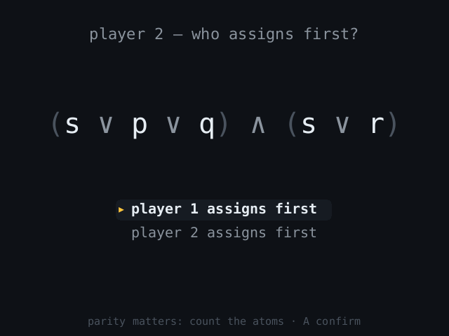
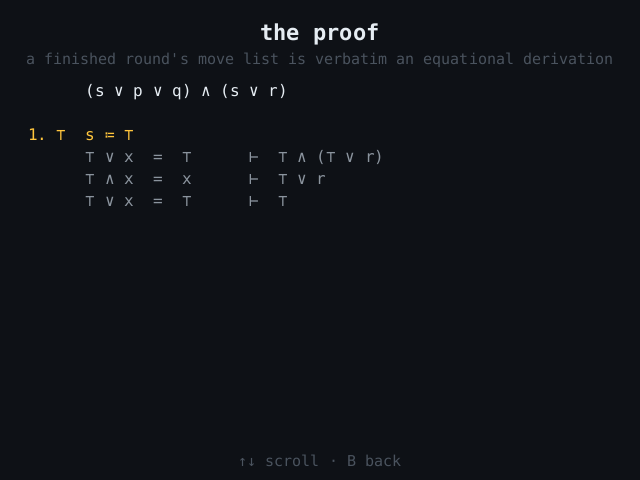

# ⊤OPP⊥E

Pronounced "Topple." The name is spelled with the game's own pieces: the T is ⊤, the L is ⊥.

Two players adversarially build a valuation, one atom per turn, and the only
physics the board obeys are the boolean laws. Every move is a choice of
branch in the formula's Shannon expansion, every board update is an
equational rewrite, and a finished game is a proof. See [GAME.md](GAME.md)
for the full design.

 

 

## The rules

```
One formula. ⊤ wants it to end ⊤; ⊥ wants it to end ⊥.

SETUP  Formula appears. One player picks a side;
       the other picks who moves first.
TURN   Pick any atom on the board and set it to ⊤ or ⊥.
       Every occurrence is replaced at once. You must move.
LAWS   The board then rewrites itself, one law at a time:
        ⊤∧x=x   ⊥∧x=⊥   ⊤∨x=⊤   ⊥∨x=x
        ⊤⇒x=x   ⊥⇒x=⊤   x⇒⊤=⊤   x⇒⊥=¬x
        (⊤=x)=x (⊥=x)=¬x ¬⊤=⊥ ¬⊥=⊤ ¬¬x=x
WIN    The instant a lone ⊤ or ⊥ remains, that side wins. No draws.
```

## Modes

- **Duel** — pass-and-play with the pie rule: one player prices the fresh
  formula and picks a side, the other picks who assigns first. The picker
  role alternates each round.
- **Online duel** (iOS) — the same pie-rule duel against a friend or a
  matched opponent, as a Game Center turn-based match. The whole match is a
  tiny replayable event log: both devices deal the identical formula from a
  shared seed and exchange only the choices.
- **Adversary** — versus a *perfect* solver. Difficulty scales by atom count
  and operator mix, never by artificial blunders. Odd rounds you pick the
  side (the dealer guarantees a dominant side exists — find it); even rounds
  you pick the tempo (the dealer guarantees the order decides — count the
  parity). First to three.
- **Puzzles** — forced wins, exactly tsumego: "⊤ in 2", "⊥ in 3", unique key
  move, perfect resistance. The first one is the worked example from the
  design doc. Ghost preview is disabled here.
- **Daily Gauntlet** — five seeded formulas, difficulty 1→5, shareable by
  code (`TPL-XXXXXXX`). Same code, same five boards, same order — compare
  scores.

Every deal is solved before it is served: no dead boards, ever. Finished
rounds can be replayed as **the proof** — the move list with each law that
fired, verbatim an equational derivation.

## Controls

| Action | Miyoo | Keyboard (desktop & web) |
| --- | --- | --- |
| move cursor between atoms | d-pad | arrows |
| assign **⊤** (top face button) | **X** | **X** or **T** |
| assign **⊥** (bottom face button) | **B** | **B** or **F** |
| zoom into a subformula | **A** | **A** or **Z** |
| ghost-preview both assignments | **Y** | **Y** or **P** |
| rules card / pause | **START** | **Enter** or **Esc** |
| replay the last move | **SELECT** | **Tab** or **Backspace** |

All occurrences of the hovered atom glow together — assignment is global.
The cascade shows each law twice — the redex it matched (amber), then what
it left behind (green). **A** steps it at your own pace, **B** skips to the
settled board, and the **↺ last move** chip (or SELECT) replays the whole
move afterwards, one step at a time with ◂ ▸.

## Building

The workspace is pure Rust. The game itself (`topple-core` + `topple-app`)
renders into a 640×480 RGBA framebuffer in software; each platform is a thin
shim around it.

### Desktop (macOS, Linux, Windows)

```sh
cargo run --release -p topple-desktop
```

winit + softbuffer, no GPU or system SDL required. The save file lands in
`~/.local/share/topple/save.bin`.

### Web

```sh
rustup target add wasm32-unknown-unknown
./scripts/build-web.sh
python3 -m http.server -d web 8080    # or any static host
```

No wasm-bindgen, no bundler: a hand-rolled C ABI, one `.wasm`, one
`index.html`. Saves live in localStorage. The daily gauntlet uses the
player's local date.

### Miyoo Mini Plus (OnionOS)

```sh
rustup target add armv7-unknown-linux-musleabihf
./scripts/build-miyoo.sh
```

Produces a single static binary (no SDL, no shared libraries — it draws
straight to `/dev/fb0` and reads `/dev/input/event0`). Copy
`dist/miyoo/Topple/` to `/mnt/SDCARD/App/Topple/` and launch it from Apps.
The stock panel is mounted upside-down; the binary rotates 180° by default
(`TOPPLE_ROT=0` to disable). Cross-linking uses the `rust-lld` that ships
with rustup (see `.cargo/config.toml`) — no external toolchain needed.

### iOS

```sh
rustup target add aarch64-apple-ios aarch64-apple-ios-sim x86_64-apple-ios
./scripts/build-ios.sh
```

The Rust static libraries build from any host; the app itself (`ios/`, a
Swift shell: touch input, virtual pad, Game Center online duels) needs a
Mac with Xcode — see [ios/APPSTORE.md](ios/APPSTORE.md) for the full path
from here to the App Store.

## Architecture

```
crates/
  topple-core     the game as mathematics: AST, the 19 rewrite laws, the
                  cascade scheduler, a perfect memoized solver, the tension-
                  filtered dealer, puzzle search, share codes. Zero deps.
  topple-app      the game as software: screens, modes, pie-rule flow,
                  cascade animation, software renderer, embedded DejaVu
                  Sans Mono. Eats buttons and milliseconds, emits pixels.
  topple-desktop  winit + softbuffer shim.
  topple-miyoo    /dev/fb0 + evdev shim (static musl).
  topple-web      wasm cdylib with a hand-rolled ABI (+ web/index.html).
  topple-ios      staticlib with the same style of C ABI (+ ios/, the
                  Swift shell: touch, virtual pad, Game Center duels).
  topple-shot     headless harness: scripted input → PNG screenshots.
```

Everything is deterministic from a seed — the same integer-only PRNG deals
the same gauntlet on ARM, wasm, and x86.

### Testing

```sh
cargo test --workspace
```

The suite includes: every law against its equation, cascade traces matching
the worked example in GAME.md line by line, the solver against a brute-force
reference on hundreds of random formulas, truth-value preservation of every
cascade, soundness of every built-in puzzle (winner, ply count, unique key
move), the dealer's tension contracts at all five difficulties, share-code
round-trips, and full games driven through the UI by synthetic button
presses. `topple-shot` renders any scripted session to PNGs for visual
review.

## Notation

The seven glyphs are Hehner's (a Practical Theory of Programming), including
`=` for boolean equality, and ⊤/⊥ read as "top"/"bottom" — the side names
come straight from him. The board fully parenthesizes everything except
same-operator chains of ∧/∨.
